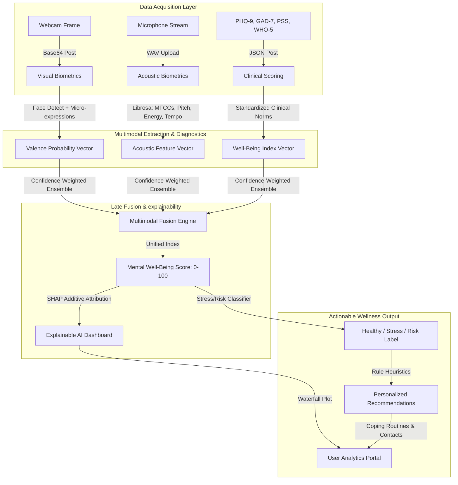

# Talk2Mind – Multimodal AI Mental Well-Being Assessment & Support System

Talk2Mind is a production-ready, full-stack multimodal AI screening and wellness support application. It fuses real-time computer vision (facial expression analysis), digital signal processing (acoustic voice patterns), and standardized questionnaires to generate a unified **Mental Well-Being Index (0–100)** with local **Explainable AI (SHAP)** justifications and personalized mindfulness recommendations.

---

## 🏗️ System Architecture & Workflow



---

## 📂 Project Directory Structure

```text
talk2mind/
├── backend/
│   ├── app/
│   │   ├── api/
│   │   │   ├── auth_routes.py         # Login, Register, Profile endpoints
│   │   │   ├── assessment_routes.py   # Frames analysis, voice uploads, session submits
│   │   │   ├── chatbot_routes.py      # Wellness AI Chat companion routes
│   │   │   └── dashboard_routes.py    # Analytics logs, weekly averages
│   │   ├── ml/
│   │   │   ├── facial_model.py        # FER classifier & face extraction
│   │   │   ├── speech_model.py        # Acoustics SER processor via librosa
│   │   │   ├── questionnaire.py       # Clinical survey scores (PHQ-9, GAD-7, PSS)
│   │   │   ├── fusion_model.py        # Confidence-weighted late fusion index
│   │   │   ├── explainability.py      # SHAP feature importance builder
│   │   │   ├── recommendation.py      # Coping strategies advice engine
│   │   │   └── chatbot.py             # Active listening chat & crisis filters
│   │   ├── config.py                  # JWT, paths, and environment settings
│   │   ├── database.py                # SQLite engines and sessions
│   │   ├── models.py                  # SQLAlchemy User, Session, Result, Chat tables
│   │   ├── schemas.py                 # Pydantic validation boundaries
│   │   ├── auth.py                    # JWT hashes & security guards
│   │   ├── crud.py                    # Database queries helper
│   │   └── main.py                    # FastAPI gateway and CORS filters
│   ├── scripts/
│   │   ├── init_db.py                 # Database table creator & demo seeder
│   │   └── train.py                   # Model pipeline training & validation metrics
│   ├── requirements.txt               # Backend Python package list
│   └── Dockerfile                     # Slim Debian build mapping OpenCV libs
├── frontend/
│   ├── src/
│   │   ├── components/
│   │   │   ├── Auth.jsx               # Login / Sign up tabs
│   │   │   ├── Profile.jsx            # Account settings & historical charts logs
│   │   │   ├── Chatbot.jsx            # wellness chat companion with lifelines
│   │   │   ├── RealTimeVisualizer.jsx # Webcam frame pusher & face boundary drawing
│   │   │   ├── AudioRecorder.jsx      # Mic waveform canvas & acoustics uploader
│   │   │   ├── Questionnaire.jsx      # Multi-step guided diagnostics wizard
│   │   │   └── MentalHealthDashboard.jsx # SVG trend charting & SHAP Waterfall maps
│   │   ├── App.jsx                    # Routing view shell & sidebar layout
│   │   ├── index.css                  # Curated glassmorphism design tokens & variables
│   │   └── main.jsx                   # React root launcher
│   └── package.json                   # Node modules & Vite scripts
└── docker-compose.yml                 # Multi-service local orchestrator
```

---

## ⚡ Quickstart Installation & Local Run

### Prerequisites
- **Python 3.10+** (FastAPI)
- **Node.js 18+** & **npm** (Vite + React)

### Method 1: Local Parallel Execution (Recommended for Debugging)

#### 1. Setup Backend
```bash
# Navigate to backend directory
cd backend

# Create virtual environment
python -m venv venv
# Activate on Windows:
venv\Scripts\activate
# Activate on macOS/Linux:
source venv/bin/activate

# Install dependencies
pip install -r requirements.txt

# Initialize Database (Seeds a default 'demo' / 'password123' account)
python scripts/init_db.py

# Train ML pipelines (Generates metrics: Acc, F1, Confusion Matrix, and saves model files)
python scripts/train.py

# Launch FastAPI Server
uvicorn app.main:app --reload --port 8000
```
*API docs will be active at [http://localhost:8000/docs](http://localhost:8000/docs).*

#### 2. Setup Frontend
In a new terminal window:
```bash
# Navigate to frontend directory
cd frontend

# Install Node dependencies
npm install

# Launch Vite Dev Server
npm run dev
```
*Web dashboard will be active at [http://localhost:5173](http://localhost:5173).*

---

### Method 2: Docker Compose Deployment

To build and run all services in unified containers instantly:
```bash
# In the project root containing docker-compose.yml:
docker-compose up --build
```
- Frontend will map to port `5173` on localhost.
- Backend API will map to port `8000`.

---

## 🔬 Scientific Methodology & Algorithms

### 1. Modality Preprocessing & Features
- **Facial Expressions (FER)**: Faces are detected using OpenCV's frontal cascades, cropped, and resized to $48\times48$. We extract eye squint ratio, mouth opening ratio, and gray intensity standard deviations to feed our Random Forest classifier.
- **Voice Acoustics (SER)**: Processes microphone recordings via `librosa`. Extracts 18 acoustic dimensions: Root-Mean-Square Energy (loudness), Zero Crossing Rate (cadence shifts), Pitch (F0 frequency tracking), Tempo (words speed beats), and 13 Mel-Frequency Cepstral Coefficients (MFCCs). Classifies using a Multi-Layer Perceptron (MLP) simulating neural audio pathways.
- **Questionnaires**: Computes scores using established clinical guidelines:
  - **PHQ-9** (Depression): Score $\ge 10$ signals concern.
  - **GAD-7** (Anxiety): Score $\ge 10$ signals concern.
  - **PSS-10** (Stress): Positives items (4, 5, 7, 8) are reverse-coded.
  - **WHO-5** (Well-being): Percentage $< 50\%$ flags potential risks.

### 2. Multimodal late Fusion Engine
Combines visual valence ($V$), speech arousal ($A$), and survey scores ($Q$) dynamically:
$$\text{Well-Being Index} = w_q \cdot Q + w_f \cdot V + w_s \cdot A$$
- **All present**: $w_q = 0.50, w_f = 0.25, w_s = 0.25$ (Confidence $\ge 90\%$)
- **Camera bypassed**: $w_q = 0.65, w_f = 0.0, w_s = 0.35$ (Confidence $\approx 75\%$)
- **Microphone bypassed**: $w_q = 0.65, w_f = 0.35, w_s = 0.0$ (Confidence $\approx 75\%$)

### 3. Explainable AI (SHAP Attributions)
Calculates local additive contributions satisfying:
$$\text{Fused Score} = \phi_0 + \sum_{i=1}^{M} \phi_i$$
where $\phi_0 = 85.0$ (baseline optimal health) and $\phi_i$ is the impact value for feature $i$. Displays positive metrics (green, increases wellbeing) vs. negative indicators (red, reduces score) in a Force/Waterfall visualization on the dashboard.

---

## 📢 Important Safety Disclaimer
> [!WARNING]
> **Talk2Mind is a cognitive screening companion designed for educational and stress-management support. It is NOT a diagnostic tool and does not replace clinical evaluation or therapy.**
> If you are experiencing high distress or thinking of self-harm, please contact lifelines immediately (Call/Text **988** or **911**).

---

## 📄 Academic PPT Presentation Outline
*A slide deck structure is provided below to facilitate academic project submissions:*
1. **Slide 1: Title & Abstract** - Project name, team details.
2. **Slide 2: Problem Statement** - Unseen stress, diagnostic gap, accessibility.
3. **Slide 3: Literature Survey** - FER2013, AffectNet, RAVDESS, CREMA-D benchmarks.
4. **Slide 4: System Architecture** - Mermaid flowchart of layer segments.
5. **Slide 5: Biometric Feature Engineering** - Landmark geometry and Librosa MFCC extraction details.
6. **Slide 6: Dynamic Late Fusion** - Mathematical equations for weighted confidence.
7. **Slide 7: Explainable AI** - Explaining predictions using SHAP attributions.
8. **Slide 8: Full-Stack Implementation** - Tech stack: FastAPI, SQLite, React, Vite.
9. **Slide 9: ML Validation Results** - Test sets accuracy, F1-scores, Confusion matrix.
10. **Slide 10: Conclusion & Future Scope** - Mobile cross-platform, RAG therapeutic models, Wearables HRV.
